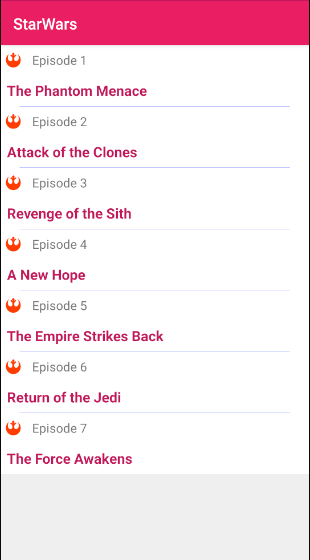
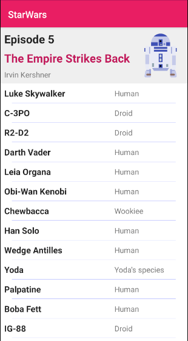

# Apollo GraphQL - Star Wars
Test project for "Introduction to GraphQL" event & article

Shows basics, how to use Apollo GraphQL in connection with Android

There are main examples of usage of Apollo Android GraphQL with:
-------
1. queries, mutations, subscriptions with callbacks - [RepositoryCallback.kt](https://github.com/MaryAgeeva/ApolloStarWars/blob/master/app/src/main/java/com/mary/starwars/data/example_repository/RepositoryCallback.kt)
2. queries, mutations, subscriptions using RxJava2 - [RepositoryRx.kt](https://github.com/MaryAgeeva/ApolloStarWars/blob/master/app/src/main/java/com/mary/starwars/data/example_repository/RepositoryRx.kt)
3. queries, mutations, subscriptions with Kotlin coroutines - [RepositoryCoroutines.kt](https://github.com/MaryAgeeva/ApolloStarWars/blob/master/app/src/main/java/com/mary/starwars/data/example_repository/RepositoryCoroutines.kt)

Screens:
-------
Sample application consists of 2 screens: 

* Films screen:
-------
List of all Star Wars films

* Details screen:
-------
Information about the chosen film

